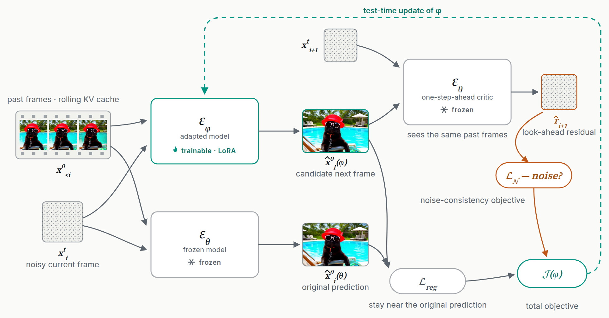

<div align="center">


# TANGO

**Test-Time Noise Guided Adaptation for Realistic Autoregressive Video Generation**

Dimitrios Karageorgiou<sup>1,2</sup> · Symeon Papadopoulos<sup>1</sup> · Ioannis Kompatsiaris<sup>1</sup> · Efstratios Gavves<sup>2</sup>

<sup>1</sup> Information Technologies Institute, CERTH · <sup>2</sup> University of Amsterdam

ECCV 2026

[](https://arxiv.org/abs/2607.15849)
[](https://mever-team.github.io/tango/)

</div>

> The code has not been released yet. Watch this repository to be notified.

Autoregressive video diffusion models eventually collapse. Prior works aim to keep each frame on the
manifold of real ones, but a trajectory whose every frame looks right can still reach a **terminal
point**: a state in the manifold of real videos that the model lacks the knowledge to continue.
TANGO detects terminal points at test time from the model's own noise predictions. Then, test-time
adaptation is employed to steer the model away from terminal points, effectively trading
inference-time compute for improved performance.

<picture>
  <source media="(prefers-color-scheme: dark)" srcset="assets/architecture-dark.png">
  
</picture>

## Citation

```bibtex
@inproceedings{karageorgiou2026tango,
  title     = {Test-Time Noise Guided Adaptation for Realistic Autoregressive Video Generation},
  author    = {Karageorgiou, Dimitrios and Papadopoulos, Symeon and Kompatsiaris, Ioannis and Gavves, Efstratios},
  booktitle = {European Conference on Computer Vision (ECCV)},
  year      = {2026}
}
```

## Acknowledgments

Supported by the Horizon Europe projects [ELIAS](https://elias-ai.eu/) (grant no. 101120237) and
[ELLIOT](https://elliot-ai.eu/) (grant no. 101214398). Computational resources were granted with the
support of [GRNET](https://grnet.gr/en/).
